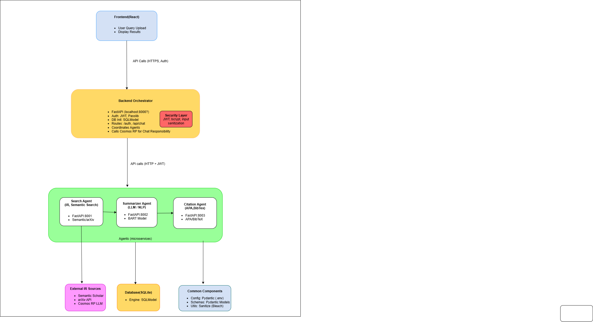

# Paper Summarizer

Welcome to the Paper Summarizer project! This application allows users to search for academic papers, view summaries, citations, and engage in conversational queries about research topics. The frontend is built with React, while the backend is a FastAPI-based microservices architecture integrating external APIs like Cosmos RP and Semantic Scholar.

## Table of Contents
- [Features](#features)
- [Architecture](#architecture)
- [Prerequisites](#prerequisites)
- [Installation](#installation)
- [Running the Application](#running-the-application)
- [Usage](#usage)
- [Configuration](#configuration)
- [Development](#development)
- [API Endpoints](#api-endpoints)
- [Contributing](#contributing)
- [License](#license)
- [Contact](#contact)

## Features
- User authentication (login/register) with JWT tokens.
- Search for academic papers based on user queries.
- Summarize paper abstracts using a pre-trained model (e.g., BART).
- Generate APA and BibTeX citations for papers.
- Conversational responses powered by Cosmos RP.
- Responsive UI with Tailwind CSS styling.

## Architecture
The system is divided into two main parts:

### Frontend (`paper-summarizer-frontend`)
- **Tech Stack**: React, React Router, Tailwind CSS, Axios.
- **Structure**:
  - `src/components/`: Reusable UI components (e.g., `Login.js`, `Chat.js`, `PaperCard.js`).
  - `src/context/`: Global state management (e.g., `AuthContext.js` for token handling).
  - `src/services/`: API service layer (e.g., `api.js` for backend calls).
- **Functionality**: Handles user interface, authentication, and chat interactions, sending queries to the backend.

### Backend (`paper-summarizer-backend`)
- **Tech Stack**: FastAPI, Python, `httpx`, `asyncio`.
- **Microservices**:
  - **Orchestrator (Port 8000)**: Manages authentication and coordinates agent tasks.
  - **Search Agent (Port 8001)**: Fetches papers from Semantic Scholar.
  - **Summarizer Agent (Port 8002)**: Generates summaries using BART.
  - **Citation Agent (Port 8003)**: Formats citations.
- **External Integration**: Cosmos RP for conversational responses.
- **Process**: A user query triggers parallel agent calls, consolidates results, and returns a JSON response.

### System Architecture Diagram


## Prerequisites
- **Node.js** (v14 or later) for the frontend.
- **Python** (v3.9 or later) for the backend.
- **npm** or **yarn** for frontend package management.
- **pip** for backend dependencies.
- **Git** for version control.
- **Docker** (optional) for containerized deployment.

## Installation

### Frontend
1. Navigate to the frontend directory:
   ```bash
   cd paper-summarizer-frontend
